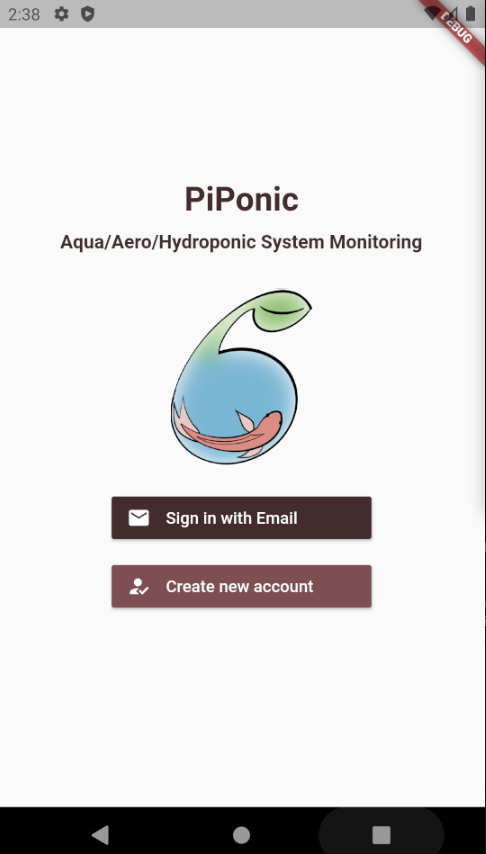
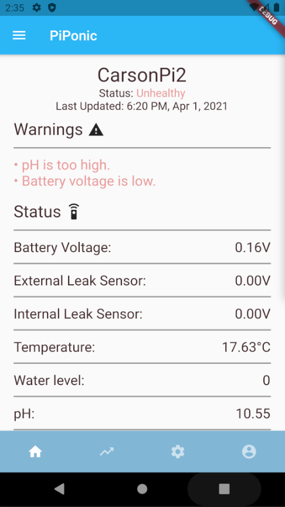
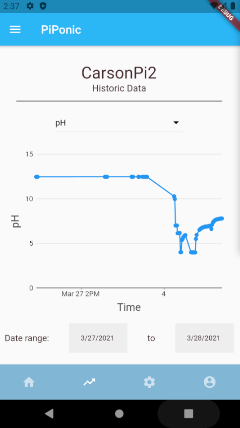
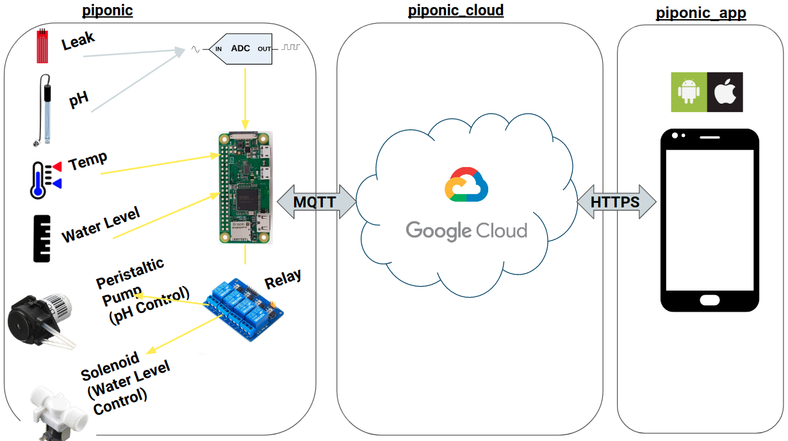

#  piponic 

## Project Description

This project aims to reduce urban food insecurity by reducing the cost and labour requirements of monitoring aquaponic or hydroponic food-growing systems. Designed specifically for hobbyist or small-scale growers, our project monitors critical system variables such as pH, temperature, and water-level and provides autonomous control. Critical notifications, real-time information, control settings, and system-history is available to users on a mobile application. 

 &nbsp;&nbsp;&nbsp;  &nbsp;&nbsp;&nbsp; 

Our work contributes a low-cost, open-source hardware design, and IoT development framework that will allow hobbyists to expand and modify the system for their own needs. By simplifying the communication protocols, growers can focus on adding new sensors instead of worrying about data-security. 

Our system can also operate on battery power in the event of a power-outage, a critical failure in aquaponic systems. This feature allows growers to be notified and to begin to take corrective action within the minute of the outage.

## System Overview

As you can see, the sensing and control system is attached to the aquaponic/hydroponic installation. Then, users can monitor an control their system remotely.



## This Repository

This repository is for the Raspberry Pi code. It manages the sensing and control system attached to a aquaponic/hydroponic installation. Currently, this includes the following sensors:

- Water pH
- Water temperature
- Water level 
- Water leakage
- Battery voltage

Additionally, this code automatically regulates the following: 

- Water pH (using a peristaltic pump to add a basic solution)
- Water level (using a solenoid to add more water)

Raspberry Pis also connect to Google Cloud IoT to communicate with our mobile application.

## Related Repositories:

- [piponic_cloud](https://github.com/jaydenleong/piponic_cloud): Google Firebase functions that connect Raspberry Pis and the mobile application.
- [piponic_app](https://github.com/jaydenleong/piponic_app): The mobile application for users to remotely monitor and control their aqua/hydroponic installation. Implemented using Google's Flutter.
- [piponic_docs](https://github.com/jaydenleong/piponic_docs): Detailed documentation for this project.

## Raspberry Pi Setup

For this project, we used a Raspberry Pi Zero W. This project should work on all other models, but this functionality has not been tested.

Before installing this project, you will need to setup your Raspberry Pi and connect to a command line or graphical interface. You will also need your Raspberry Pi to connect to WiFi. Here is some documentation to help you do that:

1. [Setup your Raspberry Pi](https://projects.raspberrypi.org/en/projects/raspberry-pi-setting-up)
1. [Connect your Raspberry Pi to WiFi](https://www.raspberrypi.org/documentation/configuration/wireless/)

Additionally, you will need to assemble the hardware for the Raspberry Pi. This includes attaching all the sensors and more. Please see the following guide for instructions about this, in [piponic_docs](https://github.com/jaydenleong/piponic_docs):

- [Installation Instructions](https://github.com/jaydenleong/piponic_docs/blob/master/docs/Installation_Instructions.pdf)

After your RPi is setup, proceed to the software installation of our project below.

## Install

Before project installation, please create a Google Cloud Project and enable the Google Cloud IoT Core API. Instructions can be found [here](https://cloud.google.com/resource-manager/docs/creating-managing-projects) to help do this.

To install this project on the Raspberry Pi and have it run on boot,
please run the following:

```
sudo ./install.sh <DEVICE-ID> <REGISTRY-ID> <PROJECT-ID>
```

Note that the parameters are as follows:

- `<DEVICE-ID>` string name to call the device (you choose)
- `<REGISTRY-ID>` string name of the Google IoT Registry (can be pre-existing, otherwise it will be auto-generated using this name)
- `<PROJECT-ID>` string name of the Google Cloud Project

Example:

```
sudo ./install.sh JaydenPi RaspberryPis piponics 
```

**IMPORTANT:**

- The install will prompt you to login into your Google Account associated 
  with your Google Cloud Project halfway through the process. Please follow the 
  link and sign in
- The install process may take around 20 minutes  

## Checking Installed Software Status 

The install script causes the `piponic.py` script to run when the raspberry pi
boots. To do this, it uses a [systemd service](https://www.raspberrypi.org/documentation/linux/usage/systemd.md). In order to check on the status of the software (running or not, etc), run
this command: 

```
sudo systemctl status piponic.service
```

Note that the `systemctl` program manages systemd services like our `piponic.service`.
So, to stop, start and restart our code from running, try the following commands:

```
sudo systemctl stop piponic.service
sudo systemctl start piponic.service
sudo systemctl restart piponic.service
```

Additionally, when testing, view logs using `journalctl`. Here is an example:

```
sudo journalctl -u piponic.service
```

## Code Documentation

This is a Python3 project. `piponic.py` is the entry point to the application.

In terms of helper modules, they are found in the `src/` directory:

- `device.py`: Holds the Raspberry Pi state and configuration. Communicates with Google Cloud IoT.
- `relay.py`: Interfaces with the relay. This is used to control the peristaltic pump which regulates pH, and the solenoid that regulates water level.
- `adc.py`: Interfaces with the ADC. This reads the water leakage, battery level, and pH sensors.
- `temp.py`: Interfaces with the water temperature sensor.
- `water_level.py`: Interfaces with water level sensors.

Example usage: 

```
import src.adc as adc
import src.temp as temp
import src.relay as relay

relay.init_one()
relay.on1()
relay.off1()

temp.read()

adc.read_pH()
adc.read_leak()
```
